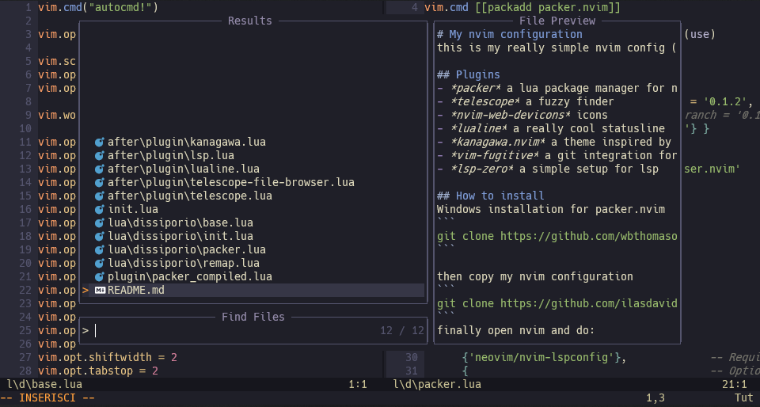
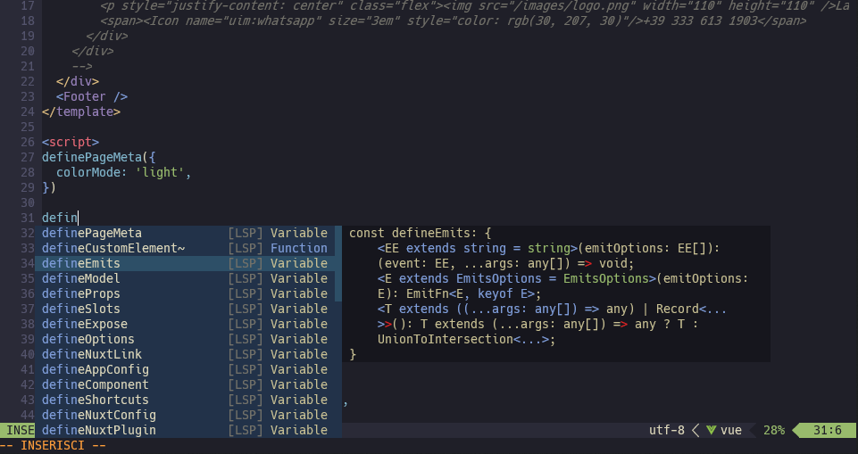

# My nvim configuration
this is my really simple nvim config (i am using windows)

## Plugins
- *packer* a lua package manager for nvim
- *telescope* a fuzzy finder
- *nvim-web-devicons* icons
- *lualine* a really cool statusline
- *kanagawa.nvim* a theme inspired by the great wave off Kanagawa
- *vim-fugitive* a git integration for vim
- *lsp-zero* a simple setup for lsp

## How to install
Windows installation for packer.nvim
```
git clone https://github.com/wbthomason/packer.nvim "$env:LOCALAPPDATA\nvim-data\site\pack\packer\start\packer.nvim"
```

then copy my nvim configuration
```
git clone https://github.com/ilasdavide2011/nvim-dotfiles.git $env:LOCALAPPDATA\nvim\
```
finally open nvim and do:
```
:PackerSync
```
to install all the packages

note: i am working on windows but many people work on linux if they use vim so you may need to make some changes to make the config work correctly
